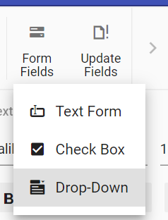

# Form fields in ##Platform_Name## Document editor control

DocumentEditorContainer component provide support for inserting Text, CheckBox, DropDown form fields through in-built toolbar.



## Insert form field

Form fields can be inserted using [`insertFormField`](../api/document-editor/editor/#insertformfield) method in editor module.

```ts
//Insert Text form field
documentEditor.editor.insertFormField('Text');
//Insert Checkbox form field
documentEditor.editor.insertFormField('CheckBox');
//Insert Drop down form field
documentEditor.editor.insertFormField('Dropdown');
```

## Get form field names

All the form fields names form current document can be retrieved using [`getFormFieldNames()`](../api/document-editor/#getformfieldnames).



```ts
let formFieldsNames: string[] = documentEditor.getFormFieldNames();
```



```js
var formFieldsNames = documentEditor.getFormFieldNames();
```

## Get form field properties

Form field properties can be retrieved using [`getFormFieldInfo()`](../api/document-editor/#getformfieldinfo).



```ts
//Get Text form field by using bookmark name.
let textfieldInfo: TextFormFieldInfo = documentEditor.getFormFieldInfo('Text1') as TextFormFieldInfo;
//Checkbox form field by using bookmark name.
let checkboxfieldInfo: CheckBoxFormFieldInfo = documentEditor.getFormFieldInfo('Check1') as CheckBoxFormFieldInfo;
//Dropdown form field by using bookmark name.
let dropdownfieldInfo: DropDownFormFieldInfo = documentEditor.getFormFieldInfo('Drop1') as DropDownFormFieldInfo;
```



```js
//Get Text form field by using bookmark name.
var textfieldInfo = documentEditor.getFormFieldInfo('Text1') as TextFormFieldInfo;
//Checkbox form field by using bookmark name.
var checkboxfieldInfo = documentEditor.getFormFieldInfo('Check1') as CheckBoxFormFieldInfo;
//Dropdown form field by using bookmark name.
var dropdownfieldInfo = documentEditor.getFormFieldInfo('Drop1') as DropDownFormFieldInfo;
```

## Set form field properties

Form field properties can be modified using [`setFormFieldInfo`](../api/document-editor/#setformfieldinfo).



```ts
// Set text form field properties
let textfieldInfo: TextFormFieldInfo = documentEditor.getFormFieldInfo('Text1') as TextFormFieldInfo;
textfieldInfo.defaultValue = "Hello";
textfieldInfo.format = "Uppercase";
textfieldInfo.type = "Text";
textfieldInfo.name = "Text2";
documentEditor.setFormFieldInfo('Text1', textfieldInfo);

// Set checkbox form field properties
let checkboxfieldInfo: CheckBoxFormFieldInfo = documentEditor.getFormFieldInfo('Check1') as CheckBoxFormFieldInfo;
checkboxfieldInfo.defaultValue = true;
checkboxfieldInfo.name = "Check2";
documentEditor.setFormFieldInfo('Check1', checkboxfieldInfo);

// Set checkbox form field properties
let dropdownfieldInfo: DropDownFormFieldInfo = documentEditor.getFormFieldInfo('Drop1') as DropDownFormFieldInfo;
dropdownfieldInfo.dropDownItems = ['One', 'Two', 'Three']
dropdownfieldInfo.name = "Drop2";
documentEditor.setFormFieldInfo('Drop1', dropdownfieldInfo);
```



```js
// Set text form field properties
var textfieldInfo = documentEditor.getFormFieldInfo('Text1');
textfieldInfo.defaultValue = "Hello";
textfieldInfo.format = "Uppercase";
textfieldInfo.type = "Text";
textfieldInfo.name = "Text2";
documentEditor.setFormFieldInfo('Text1', textfieldInfo);

// Set checkbox form field properties
var checkboxfieldInfo = documentEditor.getFormFieldInfo('Check1');
checkboxfieldInfo.defaultValue = true;
checkboxfieldInfo.name = "Check2";
documentEditor.setFormFieldInfo('Check1', checkboxfieldInfo);

// Set checkbox form field properties
var dropdownfieldInfo = documentEditor.getFormFieldInfo('Drop1');
dropdownfieldInfo.dropDownItems = ['One', 'Two', 'Three']
dropdownfieldInfo.name = "Drop2";
documentEditor.setFormFieldInfo('Drop1', dropdownfieldInfo);
```

>Note:If a form field already exists in the document with the new name specified, the old form field name property will be cleared and it will not be accessible. Ensure the new name is unique.

## Export form field data

Data of the all the Form fields in the document can be exported using [`exportFormData`](../api/document-editor/#exportformdata).



```ts
let formFieldDate: FormFieldData[] = documentEditor.exportFormData();
```



```ts
var formFieldDate = documentEditor.exportFormData();
```

## Import form field data

Form fields can be prefilled with data using [`importFormData`](../api/document-editor/#importformdata).



```ts
let textformField: FormFieldData = { fieldName: 'Text1', value: 'Hello World' };
let checkformField: FormFieldData = { fieldName: 'Check1', value: true };
let dropdownformField: FormFieldData = { fieldName: 'Drop1', value: 1 };
//Import form field data
this.container.documentEditor.importFormData([textformField, checkformField, dropdownformField]);
```



```js
var textformField = { fieldName: 'Text1', value: 'Hello World' };
var checkformField = { fieldName: 'Check1', value: true };
var dropdownformField = { fieldName: 'Drop1', value: 1 };
//Import form field data
this.container.documentEditor.importFormData([textformField, checkformField, dropdownformField]);
```

## Reset form fields

Reset all the form fields in current document to default value using [`resetFormFields`](../api/document-editor/#resetformfields).

```ts
documentEditor.resetFormFields();
```

## Protect the document in form filling mode

Document Editor provides support for protecting the document with `FormFieldsOnly` protection. In this protection, user can only fill form fields in the document.

Document editor provides an option to protect and unprotect document using [`enforceProtection`](../api/document-editor/editor/#enforceprotection) and [`stopProtection`](../api/document-editor/editor/#stopprotection) API.

The following example code illustrates how to enforce and stop protection in Document editor container.



```ts
let container: DocumentEditorContainer = new DocumentEditorContainer({
  enableToolbar: true,
  height: '590px',
});
DocumentEditorContainer.Inject(Toolbar);
container.serviceUrl =
  'https://services.syncfusion.com/js/production/api/documenteditor/';
container.appendTo('#container');

//enforce protection
container.documentEditor.editor.enforceProtection('123', 'FormFieldsOnly');

//stop the document protection
container.documentEditor.editor.stopProtection('123');
```



```js
var container = new DocumentEditorContainer({
  enableToolbar: true,
  height: '590px',
});
DocumentEditorContainer.Inject(Toolbar);
container.serviceUrl =
  'https://services.syncfusion.com/js/production/api/documenteditor/';
container.appendTo('#container');

//enforce protection
container.documentEditor.editor.enforceProtection('123', 'FormFieldsOnly');

//stop the document protection
container.documentEditor.editor.stopProtection('123');
```

>Note: In enforce Protection method, first parameter denotes password and second parameter denotes protection type. Possible values of protection type are `NoProtection |ReadOnly |FormFieldsOnly |CommentsOnly`. In stop protection method, parameter denotes the password.

## Form Field Settings

Document editor provides options to customize the form field settings using [`formFieldSettings`](../../api/document-editor/documentEditorSettingsModel/#formFieldSettings) in Document editor settings.This functionality allows users to customize various aspects of form fields. These include customizing shading colors, applying these custom colors to form fields, adjusting the color used for selecting form fields, defining the form filling mode, and specifying formatting exceptions for form fields"

### Shading color

By default, the shading color [`shadingColor`](../../api/document-editor/documentEditorSettingsModel/formFieldSettings/#shadingcolor) for form fields is '#cfcfcf'. To change it, simply specify a different hexadecimal color value in the shading color property of formFieldSettings.

The following example code illustrates how to customize the shading color property of formFieldSettings in Document editor container.



```ts
let container: DocumentEditorContainer = new DocumentEditorContainer({ enableToolbar: true,height: '590px',
  // Customize the shading color property of formFieldSettings.
  documentEditorSettings: {
    formFieldSettings : { shadingColor : '#FFFF00' },
  }
});
DocumentEditorContainer.Inject(Toolbar);
container.serviceUrl = 'https://services.syncfusion.com/js/production/api/documenteditor/';
container.appendTo('#container');
```



```js
var container = new DocumentEditorContainer({ enableToolbar: true,height: '590px',
  // Customize the shading color property of formFieldSettings.
  documentEditorSettings: {
    formFieldSettings : { shadingColor : '#FFFF00' },
  }
});
DocumentEditorContainer.Inject(Toolbar);
container.serviceUrl = 'https://services.syncfusion.com/js/production/api/documenteditor/';
container.appendTo('#container');
```

>Note: You can customize shading color in application level, but cannot be exported in file level

### Apply shading

By default, the apply shading [`applyshading`](../../api/document-editor/documentEditorSettingsModel/formFieldSettings/#applyshading) for form fields is true. To toggle the default shading for form fields, simply switch between true and false.

The following example code illustrates how to customize the apply shading property of form field settings in Document editor container.



```ts
let container: DocumentEditorContainer = new DocumentEditorContainer({ enableToolbar: true,height: '590px',
  // Customize the apply shading property of formFieldSettings.
  documentEditorSettings: {
    formFieldSettings : { applyShading : false },
  }
});
DocumentEditorContainer.Inject(Toolbar);
container.serviceUrl = 'https://services.syncfusion.com/js/production/api/documenteditor/';
container.appendTo('#container');
```



```js
var container = new DocumentEditorContainer({ enableToolbar: true, height: '590px',
  // Customize the apply shading property of formFieldSettings.
  documentEditorSettings: {
    formFieldSettings : { applyShading : false },
  }
});
DocumentEditorContainer.Inject(Toolbar);
container.serviceUrl = 'https://services.syncfusion.com/js/production/api/documenteditor/';
container.appendTo('#container');
```

### Selection color

By default, the selection color [`selectioncolor`](../../api/document-editor/documentEditorSettingsModel/formFieldSettings/#selectioncolor) for form fields is '#cccccc'. To change it, simply specify a different hexadecimal color value in the shadingColor property of form field settings.

The following example code illustrates how to customize the selection color property of form field settings in Document editor container.



```ts
let container: DocumentEditorContainer = new DocumentEditorContainer({ enableToolbar: true,height: '590px',
  // Customize the selection color property of formFieldSettings.
  documentEditorSettings: {
    formFieldSettings : { selectionColor : '#FFFF00' },
  }
});
DocumentEditorContainer.Inject(Toolbar);
container.serviceUrl = 'https://services.syncfusion.com/js/production/api/documenteditor/';
container.appendTo('#container');
```



```js
var container = new DocumentEditorContainer({ enableToolbar: true,height: '590px',
  // Customize the selection color property of formFieldSettings.
  documentEditorSettings: {
    formFieldSettings : { selectionColor : '#FFFF00' },
  }
});
DocumentEditorContainer.Inject(Toolbar);
container.serviceUrl = 'https://services.syncfusion.com/js/production/api/documenteditor/';
container.appendTo('#container');
```


### Form filling mode 

The default form filling mode [`formfillingmode`](../../api/document-editor/documentEditorSettingsModel/formFieldSettings/#formfillingmode) for form fields is 'Popup'. To change this default behavior, switch between 'Inline' and 'Popup' as needed.

The following example code illustrates how to customize the form filling mode property of form field settings in Document editor container.



```ts
let container: DocumentEditorContainer = new DocumentEditorContainer({ enableToolbar: true,height: '590px',
  // Customize the form filling mode property of formFieldSettings.
  documentEditorSettings: {
    formFieldSettings : { formFillingMode : 'Inline' },
  }
});
DocumentEditorContainer.Inject(Toolbar);
container.serviceUrl = 'https://services.syncfusion.com/js/production/api/documenteditor/';
container.appendTo('#container');
```



```js
var container = new DocumentEditorContainer({ enableToolbar: true,height: '590px',
  // Customize the form filling mode property of formFieldSettings.
  documentEditorSettings: {
    formFieldSettings : { formFillingMode : 'Inline' },
  }
});
DocumentEditorContainer.Inject(Toolbar);
container.serviceUrl = 'https://services.syncfusion.com/js/production/api/documenteditor/';
container.appendTo('#container');
```

### Formatting exceptions

The default formatting exceptions [`formattingexceptions`](../../api/document-editor/documentEditorSettingsModel/formFieldSettings/#formattingexceptions) for form fields are an empty array, indicating no exceptions. To modify this default behavior, specify the desired formatting exceptions in the array assigned to the formattingExceptions property, utilizing the provided list of acceptable values.

The customizable options for formatting exceptions in form fields include: 'Bold', 'Italic', 'FontSize', 'FontFamily', 'HighlightColor', 'BaselineAlignment', 'Strikethrough', 'Underline', 'FontColor', 'TextAlignment', 'LeftIndent', 'RightIndent', 'LineSpacing', 'LineSpacingType', 'FirstLineIndent', 'AfterSpacing', 'BeforeSpacing', 'ContextualSpacing', and 'ListFormat'.

The following example code illustrates how to customize the formatting exceptions property of form field settings in Document editor container.



```ts
let container: DocumentEditorContainer = new DocumentEditorContainer({ enableToolbar: true,height: '590px',
  // Customize the formatting exceptions property of formFieldSettings.
  documentEditorSettings: {
    formFieldSettings : { formattingExceptions : ['Bold'] },
  }
});
DocumentEditorContainer.Inject(Toolbar);
container.serviceUrl = 'https://services.syncfusion.com/js/production/api/documenteditor/';
container.appendTo('#container');
```



```js
let container: DocumentEditorContainer = new DocumentEditorContainer({ enableToolbar: true,height: '590px',
  // Customize the formatting exceptions property of formFieldSettings.
  documentEditorSettings: {
    formFieldSettings : { formattingExceptions : ['Bold'] },
  }
});
DocumentEditorContainer.Inject(Toolbar);
container.serviceUrl = 'https://services.syncfusion.com/js/production/api/documenteditor/';
container.appendTo('#container');
```

>Note: You can customize formatting exceptions in application level, but cannot be exported in file level